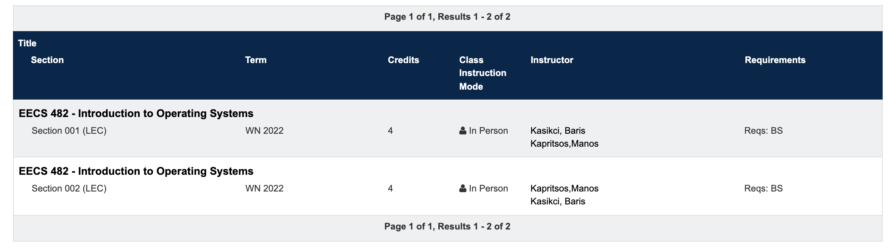
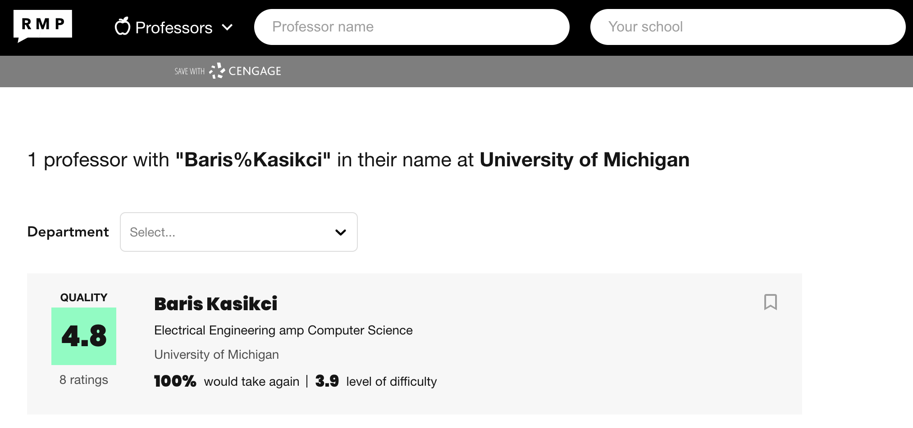
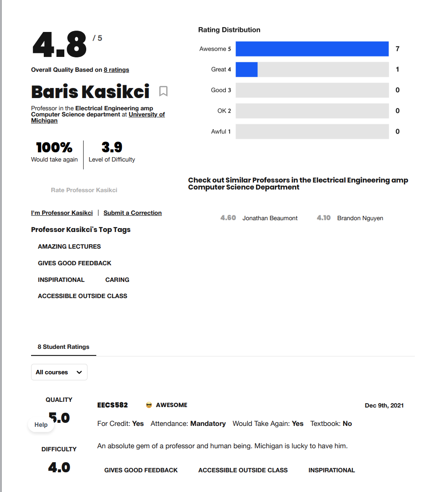
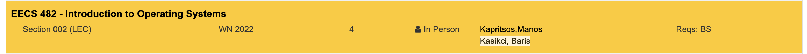
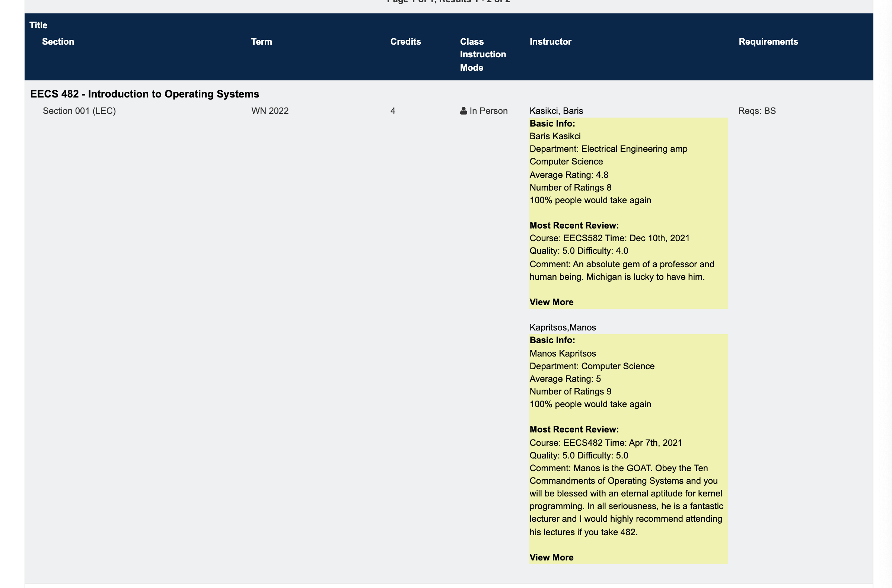

# RateMProfessors

This tool simplifies the process of looking up professors' RMP page on UM's LSA Course Guide at https://www.lsa.umich.edu/cg/default.aspx.

## Previously when students looks up an instructor on RMP for a course, their workflow will be the following (i.e. EECS482):
1) Go to https://www.lsa.umich.edu/cg/default.aspx, enter course name;
2) On https://www.lsa.umich.edu/cg/cg_results.aspx?termArray=w_22_2370&cgtype=ug&show=20&department=EECS&catalog=482, they can find all the instructors

3) Go search for the professor's name on RMP after inverting the first and last names (note that the lsa cg has a format where last name apears before first name).

4) From the list of professors with the same name, choose the one you like to click for the personal page

5) Go back to cg and repeat.

## This tool simplifies the workflow above through automating sending get requests and parsing the responding objects into useful information students look for on RMP. The new simplified workflow is the following:
1) Go to https://www.lsa.umich.edu/cg/default.aspx, enter course name;
2) Hover the mouse over any instructor's name where a blinking highlighting effect will confirm the correct action

3) Click the instructor's name and there will be basic info on his/her RMP page as well as the first review if there is one. The user can also click the "view more" text to see the instructor's personal RMP page. If there are multiple instructors teaching a course, students can have their RMP info expanded side to side for a better comparison.

## Here are some design choices for reference:
1) RMP changed the response for a get request of the list of instructors given a name and school from a complete html page to a template html page with javascript scripts that generates the complete page. It makes it hard to access each piece of information (i.e. quality rating) from the html through calling functions such as .getElementById(). The solution is to convert the javascript script into a nested json object and access information (including the legacyId which is used to reach the instructor's personal page on RMP" by parsing the nested json object.
2) To access information such as quality rating, first review, etc on the instructor's personal RMP page by looking for an element's id or classname, a dummy node is used where its innerHTML is set to be RMP server's response to the get request so that we can perform subsequent parsing and element lookups through querySelector.

## Build method: 
Others have noted that RMP has been asking similar tools to be removed from app stroes and chrome extension stores, so for now this tool will not be uploaded to any of the official platforms, and users will need to manually pull from this repository and load it in their chrome extension. Here are the steps:
1) Pull from the repository,
2) Go to chrome://extensions/
3) Click "Load unpacked" on the top-left corner
4) Select RateMProfessors/front_end, and that's it!

## Future improvements:
1) Enable users to iterate through each instructors with the same first and last name at UM to reduce ambiguity
2) Better and sexier visualization display
